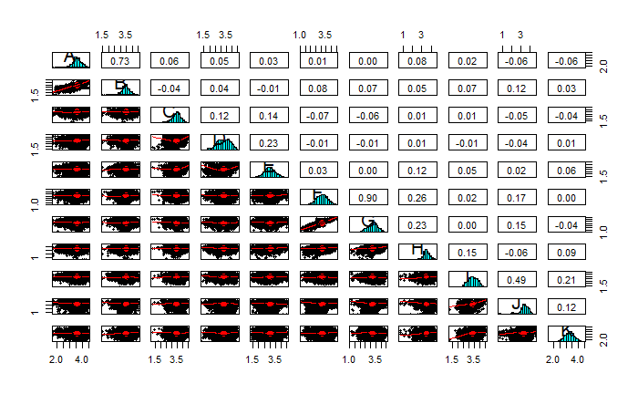

```{r setup, include=FALSE}
knitr::opts_chunk$set(echo = FALSE)
options(knitr.table.format = "latex")
library("tidyverse")
library("ggplot2")
library("psych")
library("igraph")
library("knitr")
library("magrittr")
```


```{r, include=FALSE}
# Load Data
data <- read_csv("a1_data.csv")
ggplot(pivot_longer(data, everything()), aes(value)) +
  geom_histogram(bins = 100) +
  facet_wrap(~name, nrow = 3)

```


# Define the assumptions that you would like to make.
First it must be noted that we test two different approaches. Both rely on the same assumptions, which are:  
1. There is a causal relationship between the variables
2. The causal relationship(s) (i.e. the graph) are acyclic and with no self-loops 
3. the model is an additive noise model, i.e. the variance of a node is at least as big as the variance of the one that it is directed from, plus some additional noise $\epsilon$. This noise $\epsilon$ is independent and identically distributed (i.e. noise of all variables comes from the same distribution) with a normal distribution with mean $0$ and standard deviation $\sigma$. 

Maybe include: 
After checking the distributions of our data and although at first they seemed somewhat similar, the results of the Kolgomorov-Smirnov tests stated that they are of a different distributions. The correlation matrix tells us that there are not many significant correlations.


# Develop a procedure to estimate the DAG from the data using your assumptions.

We tested two methods to create DAGs.

## First Method: Brute force regression

The first approach is a simple one. In the first step, we took a simpler but insightful approach to see the data clearly and determine the appropriate approach. For that reason, we took each of our variables one by one as the target variable and regressed them with all the other ones. 

Then we checked the significance of these connections by checking the p-values (significant if p-value < 0.05). When the t-test suggested that the predictor variable has a significant effect on the target variable, we established a connections. 

After creating a connectivity matrix, we tested the variances between the connected nodes with an F-test and by doing so, we identified the directions with the following method: 

* No arrow between two nodes, if there is no significance. (meanin no influence between x and y)
* x -> y if variance of x is less than variance of y. (meanin x influence y)
* x <- y if variance of x is greater than variance of y. (meanin y influence x)

Although it can be desirable to include all of the variables when regressing there are some issues with it as well, which will be discussed in the limitations. We checked for multicollinearity and the amount was not significant but also not ideal. This method closely follows the method proposed in @Park, with some deviations. 

## Second method: sortnregress

For the second approach we used the sortnregress method, which was introduced during the lecture and is based on @Reisach2021BewareOT. To summarize the approach, with sortnregress the variables are initially ranked by their variances, from lowest to highest variance. As we assume an additive noise model, a variable that is influenced by another variable must have at least the noise of the variable that it is influenced by, plus some additional noise. 
Then, each variable is linearly regressed on all the other variables having lower variance than the variable itself. 

In detail, a first a linear regression is performed to get the coefficients. After that, a LASSO regression is performed, where the regressors are multiplied by the absolute value of the coefficients of the linear regression, making variables that have only a small effect in the linear regression even smaller in the LASSO regression. The LASSO regression lets coefficients for less important variables go to zero, having the effect of pruning connections between variables in the DAG.

Lasso Regression: Lasso is short for Least Absolute Shrinkage and Selection Operator, which is used both for regularization and model selection. 

L_{Lasso}\left(\beta\right)=\sum_{i=1}^n\ ({y_i+\ x_i^\prime\hat{\beta})}^2+\ \lambda\sum_{J=1}^{m}\left|\widehat{\beta_j}\right|\ 

# Implement your procedure in R or Python and report your DAG

The code used for this assignment can be found at https://github.com/SimonJasansky/comp_stat_A1. 
Our code for sortnregress closely follows the code provided by @Reisach2021BewareOT, that is available at https://github.com/Scriddie/Varsortability. 
For the regressions used in the sortnregress algorithm, the scikit-learn implementation of Linear regression and LASSO regression were used, where the LASSO regression uses least-angle regression (LARS) with the Bayesian information criterion to prune varibles. 

Initially, we inspected the variances to get an overview
```{r, echo = FALSE}
# rank variables by variance
variances <- data %>% summarise_if(is.numeric, var)
variances_df = tibble("vars" = variances %>% names(), "variance" = as.numeric(variances[1,]))
variances_df %<>% arrange(variance, decreasing = TRUE)
knitr::kable(variances_df, align = "c", caption = "Variances per variable in decreasing order")
```


```{r, include=FALSE}
fit = lm(D ~ . , data)
p_values = summary(fit)$coefficients[,4]
a_vector = ifelse(p_values < 0.05, 1, 0)
summary(fit)
print(a_vector)

```

```{r, include=FALSE}
colnam = colnames(data)
connections_vec = c()

for (i in 1:11) {
  variab = colnam[i]
  fit = lm(paste(variab, "~ .", sep = " ") , data) # model building
  p_values = summary(fit)$coefficients[,4] # p_vale extract
  con_vec = as.vector(ifelse(p_values < 0.05, 1, 0)) #significant or not
  connections = append(con_vec, 0, i) #0 to own place
  connections = connections[2:12] #taking out intercept
  connections_vec = append(connections_vec,connections) # appending to one vector
} 


M = matrix(connections_vec, 11, 11, byrow = T, dimnames = list(paste(colnam, "_from", sep = ""),paste(colnam, "_to", sep = "")))


directions = data.frame(M)


print("both ways")
print(directions)


for (r in 1:10){
  for (c in (r+1):11){
    
    vartest = var.test(unlist(data[r]), unlist(data[c]), alternative = "greater")
    
    if (0.05>vartest$p.value) {
      directions[r,c] = 0
    } else {
      directions[c,r] = 0
    }
  }
}

print("one way")
print(directions)


```

```{r, include=FALSE}
#pairs.panels(a1_data)

direc_with_good_names = directions
colnames(direc_with_good_names) = colnames(data)
row.names(direc_with_good_names) = colnames(data)

for_graph = as.matrix(direc_with_good_names)

g = graph.adjacency(for_graph)
```

```{r, include=FALSE}
plot.igraph(g,
            main = "GeriGraph",
            vertex.size = 28,
            vertex.color = "gray",
            vertex.frame.width = 1.75,
            label = colnames(data),
            vertex.label.color = "black",
            vertex.label.font = 1,
            vertex.label.cex = 1.1,
            edge.color = "black",
            edge.arrow.size = 0.5,
            edge.width = 1.5,
            layout = matrix(c(0,-10,-5,-8,-9,-4,-10,1,-8,7,-3,10,3,10,8,7,10,1,9,-4,5,-8), nrow = 11, ncol = 2, byrow = T))


```

```{r, include=FALSE}
library(readxl)
SimonData = read_csv("graph.csv")

SimonData = SimonData[2:12]

SimonData = ifelse(SimonData == 0, 0, 1)

SimonGraph = graph.adjacency(SimonData)

plot.igraph(SimonGraph,
            main = "SimonGraph",
            vertex.size = 28,
            vertex.color = "gray",
            vertex.frame.width = 1.75,
            label = colnames(data),
            vertex.label.color = "black",
            vertex.label.font = 1,
            vertex.label.cex = 1.1,
            edge.color = "black",
            edge.arrow.size = 0.5,
            edge.width = 1.5,
            layout = matrix(c(0,-10,-5,-8,-9,-4,-10,1,-8,7,-3,10,3,10,8,7,10,1,9,-4,5,-8), nrow = 11, ncol = 2, byrow = T))


```

```{r, include=FALSE}
difference = as.matrix(SimonData) - as.matrix(direc_with_good_names)
sum(abs(difference))
```

## Comparing the two models

In the following figure, you can see the DAGs resulting from the two implemented methods. 
```{r, echo = FALSE}
par(mfrow=c(1,2))
plot.igraph(g,
            main = "Graph from simple regressions",
            vertex.size = 28,
            vertex.color = "gray",
            vertex.frame.width = 1.75,
            label = colnames(data),
            vertex.label.color = "black",
            vertex.label.font = 1,
            vertex.label.cex = 1.1,
            edge.color = "black",
            edge.arrow.size = 0.5,
            edge.width = 1.5,
            layout = matrix(c(0,-10,-5,-8,-9,-4,-10,1,-8,7,-3,10,3,10,8,7,10,1,9,-4,5,-8), nrow = 11, ncol = 2, byrow = T))
plot.igraph(SimonGraph,
            main = "Graph from sortnregress",
            vertex.size = 28,
            vertex.color = "gray",
            vertex.frame.width = 1.75,
            label = colnames(data),
            vertex.label.color = "black",
            vertex.label.font = 1,
            vertex.label.cex = 1.1,
            edge.color = "black",
            edge.arrow.size = 0.5,
            edge.width = 1.5,
            layout = matrix(c(0,-10,-5,-8,-9,-4,-10,1,-8,7,-3,10,3,10,8,7,10,1,9,-4,5,-8), nrow = 11, ncol = 2, byrow = T))

```

The are similar in most nodes and edges, but do have differences. 

As seen in DAG, the are similar common results in most nodes and edges in the two methods. There are 11 edge differences in total between the two analysis and these differences mean 10% in all data set. While 5 nodes which are D,E,F,J and K gave exactly the same results, 1 or 2 edge differences were observed in the other 6 nodes that are A,B,C,G,H and I. 

The most important reason for these, in the first method differences is the relationship of the selected node with the other one , while the varryance between the two nodes is taken into account (F-test), in the second method, firstly, the variance order of the variables is made and then linear regression analysis is performed with those with a smaller variance (LASSO Regression).

The key difference in the two analyzes is in the edges coming to the E and G nodes. While in the first approach there were more incoming edges to the E node - the total incoming edge was 6, in the second approach it reduced to 3. On the other hand, while the edges coming to the G node were 3 in the first approach, it increased to 6 in the sortnregress approach. The signaficant reason for this is the moment of processing the variance while creating the loops, as mentioned before. In the first approach, the variance between the two nodes was examined, in the second approach, the variances were listed and operations were performed.


# Explain what the limits of your procedure are, both statistically and in terms of possible violations of your assumption with real world data

The DAG procedure assumes that there is a causal relationship between the variables, that the causal relationship is acyclic and has no self-loops, and that the errors follow an additive noise model with uniform, independent errors. Violations of these assumptions can lead to biased estimates of the causal relationships. 
	
And also these assumtions have the causal direction is known and that the causal ordering is correct. In practice, it was difficult to determine the correct causal ordering, and it may be necessary to use multiple methods to identify the causal direction.

Given identifiability condition could be very restrictive, even if it is very general version of the conditions for linear structural equation models (SEMs).
	
Additionally, Additive Noise Models (ANMs) statistical consistency of learning non-linear have been not provided yet.

The DAG procedure can identify correlations between variables, but it does not necessarily identify causal relationships. Careful interpretation of the results is necessary to determine whether the relationships identified by the DAG procedure are truly causal.

Furthermore, Real-world data often includes confounding variables, which can complicate the estimation of causal relationships. And also, the assumptions of the DAG procedure may not hold for all types of data, such as data that include discrete variables or time-varying relationships.

\pagebreak

# Appendix

```{r}

```

\pagebreak

# References

\bibliography{references}

